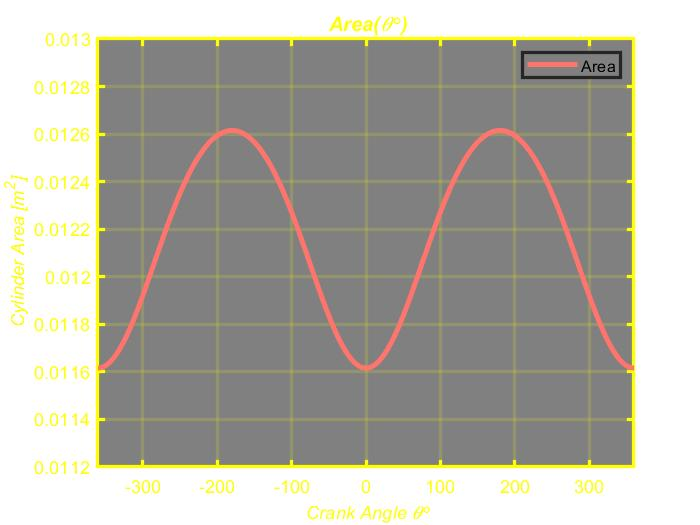
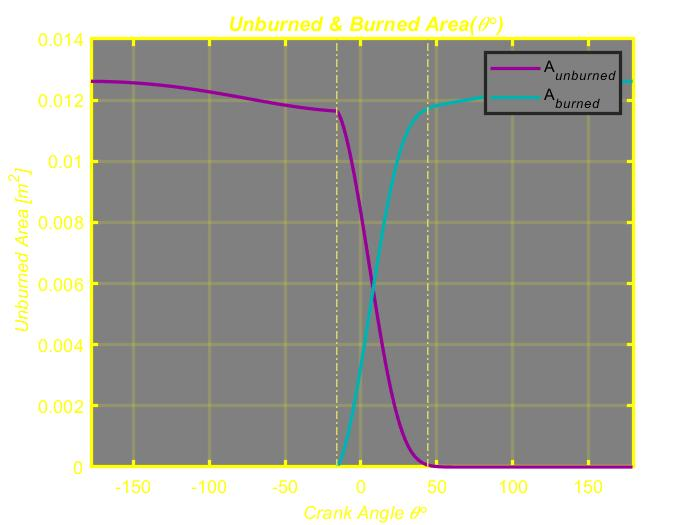
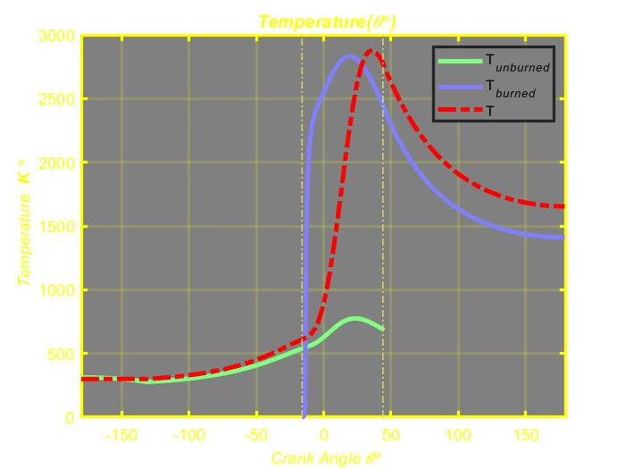
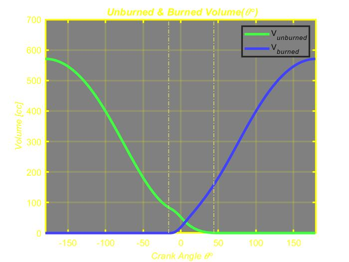
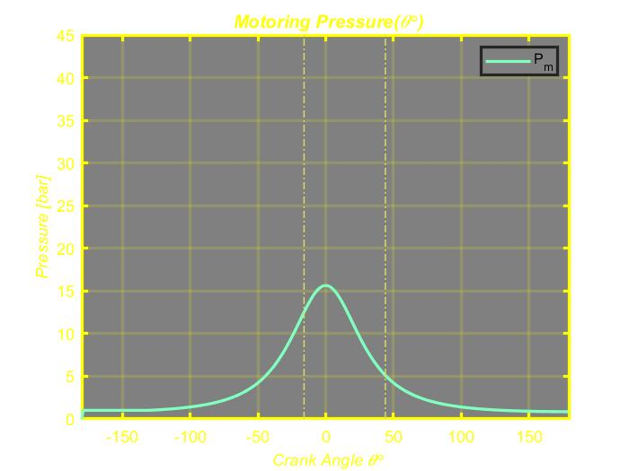
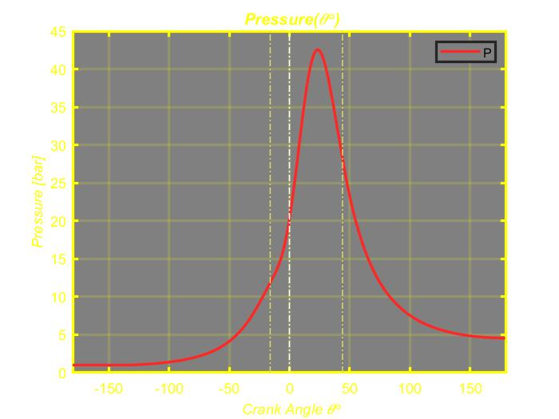

---

 # **Simulation of a Two-Zone Model of a Combustion Engine**

---
A two-zone model is simulated with MATLAB, and you can find Volume, Area, Velocity, Burn Fraction, Unburned/Burned Area/Mass/Temperature/Volume, Pressure, and Work here.

In Sec.1 some initial values such as Compression Ratio, density, etc are configured.

In Sec.2 Volume and Area are calculated.

 

Fig.1 –Each Cylinder Volume

 

 

Fig.2 – The Cylinder Area

 

In Sec.3 The velocity is calculated.

 

Fig.3 – The Velocity

 

In Sec.4 The burn Fraction is calculated.

 

Fig.4 – The Burn Fraction

  
In Sec.5 The main calculation is done.

 
  
Fig.5 – The Unburned/Burned Area

 

 

Fig.6 –  The Unburned/Burned Mass

 

 

Fig.7 – The Unburned/Burned Temperature

 

 

Fig.8 – The Unburned/Burned Volume

 

 

Fig.9 – The Motoring Pressure

 

Fig.10 – The Pressure

 

 

Fig.11 – The Work

 

  
In Sec.6 & 7 figures are configured.
